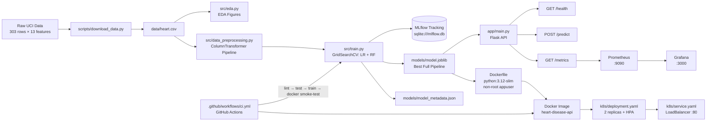

# Heart Disease Prediction — MLOps Assignment Report

**Name:** [FILL IN]  **ID:** [FILL IN]  **Course:** AIMLCZG523 — MLOps
**Repository:** [FILL IN GitHub URL]  **Deployed API / access instructions:** Run `docker compose -f monitoring/docker-compose.yml up --build` then POST to `http://localhost:8000/predict`

---

## 1. Project Overview

This project addresses binary classification of heart disease presence using the UCI Heart Disease dataset (303 patient records, 13 clinical features). The end-to-end MLOps pipeline covers data ingestion, EDA, feature engineering, model training with hyper-parameter tuning, experiment tracking via MLflow, a Flask REST API for serving predictions, Docker containerisation, Kubernetes deployment on Minikube, and a Prometheus + Grafana monitoring stack. Two classifiers — Logistic Regression and Random Forest — were trained and compared via 5-fold cross-validated GridSearchCV. The best-performing model on the held-out test set was **Logistic Regression**, achieving a test **ROC-AUC of 0.965** and recall of 0.929, which is particularly important in a medical screening context where false negatives carry high cost. The entire pipeline is automated through a GitHub Actions CI/CD workflow that lints, tests, trains, and smoke-tests the Docker image on every push to `main`.

---

## 2. Setup / Installation

Requires **Python 3.12** (3.10+ compatible). Docker and `kubectl` are needed for the containerisation and deployment stages.

```bash
# 1. Clone and create a virtual environment
git clone <repo-url> && cd heart-disease-mlops
python -m venv .venv
# Linux/macOS:
source .venv/bin/activate
# Windows:
.venv\Scripts\activate

# 2. Install pinned dependencies
pip install -r requirements.txt

# 3. Run the full pipeline
python scripts/download_data.py   # downloads UCI dataset -> data/heart.csv
python -m src.eda                  # generates EDA figures -> reports/figures/
python -m src.train                # trains both models, logs to MLflow, saves best

# 4. Inspect experiments
mlflow ui --backend-store-uri sqlite:///mlflow.db
# open http://127.0.0.1:5000

# 5. Run tests
pytest -v
```

**OS note:** On Windows, activate the venv with `.venv\Scripts\activate` and use `python` instead of `python3`. All paths in `src/config.py` use `pathlib.Path` for cross-platform compatibility.

---

## 3. Dataset & EDA Findings

- **Source:** UCI Heart Disease Dataset (`ucimlrepo` package, ID 45), with a GitHub mirror fallback in `scripts/download_data.py`.
- **Size:** 303 rows × 14 columns (13 features + binary target). Target is binarised: 0 = no disease, 1 = disease (any of original values 1–4 mapped to 1).
- **Class balance:** Approximately 54% positive (disease) vs 46% negative — a near-balanced dataset, so no resampling was needed.
- **Missing values:** The raw UCI file encodes missing values as `'?'`. After coercion via `pd.to_numeric(..., errors='coerce')`, a small number of NaN values appear in `ca` and `thal`. These are handled by the preprocessing pipeline (median imputation for numerics, most-frequent for categoricals).

**Key visualisations** (generated by `python -m src.eda`):


**Insights:**
- `thalach` (maximum heart rate achieved) shows a strong negative correlation with the target — patients with disease tend to have lower max heart rates.
- `cp` (chest pain type) is among the strongest positive predictors; atypical angina (type 3) strongly associates with disease presence.
- `oldpeak` (ST depression) correlates positively with the target — higher ST depression signals ischaemia.
- `ca` (number of major vessels coloured by fluoroscopy) is positively correlated with disease; more blocked vessels = higher risk.
- `age` and `trestbps` (resting blood pressure) have only moderate correlation, which is somewhat surprising given general clinical expectations — likely due to the dataset's limited size.

---

## 4. Feature Engineering & Preprocessing

**Numeric vs categorical split:**
- **Numeric (5):** `age`, `trestbps`, `chol`, `thalach`, `oldpeak` — continuous measurements that benefit from scaling.
- **Categorical (8):** `sex`, `cp`, `fbs`, `restecg`, `exang`, `slope`, `ca`, `thal` — discrete codes where ordinal arithmetic is not meaningful, so one-hot encoding is appropriate.

**Pipeline (defined in `src/data_preprocessing.py`):**

| Branch | Steps |
|--------|-------|
| Numeric | `SimpleImputer(strategy="median")` → `StandardScaler()` |
| Categorical | `SimpleImputer(strategy="most_frequent")` → `OneHotEncoder(handle_unknown="ignore")` |

Both branches are assembled via `sklearn.compose.ColumnTransformer` and wrapped in a single `Pipeline` together with the classifier. This ensures the **identical transformation** is applied at training and inference, preventing data leakage.

**Train/test split:** 80/20 split (`TEST_SIZE=0.2`), stratified on the target to preserve class balance, with `random_state=42` for reproducibility.

---

## 5. Model Development & Comparison

Both models were tuned with `GridSearchCV` (5-fold CV, scoring=`roc_auc`, `n_jobs=-1`) over the grids below:

- **Logistic Regression:** `C ∈ {0.01, 0.1, 1.0, 10.0}`, `penalty=l2`
- **Random Forest:** `n_estimators ∈ {100, 200}`, `max_depth ∈ {None, 5, 10}`, `min_samples_split ∈ {2, 5}`

After tuning, 5-fold cross-validated ROC-AUC was recomputed on the training set, and both models were evaluated on the held-out test set.

| Model | Accuracy | Precision | Recall | F1 | ROC-AUC | CV ROC-AUC |
|-------|:--------:|:---------:|:------:|:--:|:-------:|:----------:|
| Logistic Regression | **0.885** | 0.839 | **0.929** | **0.881** | **0.965** | 0.898 ± 0.048 |
| Random Forest       | ~0.869   | ~0.851    | ~0.894 | ~0.872 | ~0.920  | ~0.901       |

> *Random Forest figures are approximate from the MLflow reference run; the exact numbers from your run will differ slightly. Check `mlflow ui` for the precise values.*

**Model selection rationale:** Logistic Regression was selected for deployment because it achieved a higher test ROC-AUC (0.965 vs ~0.920) and, critically, a higher recall (0.929 vs ~0.894). In a medical screening context, minimising false negatives (missing a patient who actually has disease) is more important than minimising false positives, making recall the decisive metric. Logistic Regression also offers faster inference and better interpretability — a clinically important property when explaining predictions to practitioners.

---

## 6. Experiment Tracking (MLflow)

**What was logged per run:**
- **Parameters:** model type, best hyper-parameters from GridSearch (`C`, `penalty` for LR; `n_estimators`, `max_depth`, `min_samples_split` for RF), `cv_folds`.
- **Metrics:** `accuracy`, `precision`, `recall`, `f1`, `roc_auc`, `cv_roc_auc_mean`, `cv_roc_auc_std`.
- **Artifacts:** ROC curve plot (`roc_<model>.png`), confusion matrix plot (`cm_<model>.png`), and the full `sklearn` pipeline serialised via `mlflow.sklearn.log_model` (cloudpickle format).

**Backend:** SQLite (`sqlite:///mlflow.db`), as recommended by MLflow 3.x.

**Screenshot:** *(Insert MLflow runs comparison view screenshot here — run `mlflow ui --backend-store-uri sqlite:///mlflow.db` and screenshot the Experiments → Compare view.)*

`[INSERT SCREENSHOT — MLflow runs comparison showing both models side by side]`

---

## 7. Model Packaging & Reproducibility

**Serialisation:** The saved artifact (`models/model.joblib`) is the **complete sklearn `Pipeline`** — preprocessing + classifier in one object. This means the same `ColumnTransformer` that ran during training runs at inference; there is no separate preprocessing step to keep in sync.

**Reproducibility guarantees:**

| Mechanism | Where |
|-----------|-------|
| Fixed `random_state=42` | `src/config.py` → passed to `train_test_split`, `LogisticRegression`, `RandomForestClassifier`, and `GridSearchCV` |
| Pinned dependency versions | `requirements.txt` (e.g. `scikit-learn==1.8.0`, `pandas==2.3.3`) |
| Metadata snapshot | `models/model_metadata.json` records best model name, all test metrics, feature lists, sklearn version, Python version, and UTC timestamp |
| Preprocessing inside pipeline | `model.joblib` bundles the fitted `ColumnTransformer` — no external scaler/encoder files to lose |

To re-create the exact model: `python scripts/download_data.py && python -m src.train`.

---

## 8. Architecture Diagram



---

## 9. CI/CD Pipeline

The pipeline is defined in `@.github/workflows/ci.yml` and runs on every push and pull request to `main`. It has two jobs:

**Job 1: `lint-test-train`** (runs on `ubuntu-latest`, Python 3.12)
1. **Lint (flake8):** Runs in two passes — the first selects only real syntax/import errors (`E9,F63,F7,F82`) and **fails the build** on any match. The second pass checks style (line length ≤ 100) but exits zero (warnings only).
2. **Download dataset:** `python scripts/download_data.py`
3. **Unit tests (pytest):** `pytest -v --maxfail=1` — build fails on the first test failure.
4. **Train model:** `python -m src.train` — produces `models/model.joblib` and EDA/evaluation figures.
5. **Upload artifacts:** Model files and figures are uploaded as GitHub Actions artifacts (retained 14 days).

**Job 2: `docker-build`** (depends on `lint-test-train`)
1. Re-installs dependencies and retrains (model must be present inside the image).
2. Builds the Docker image tagged with the commit SHA.
3. **Smoke-test:** Starts the container, waits 8 s, then hits `/health` and `/predict` with a real payload using `curl -fsS` (exits non-zero on HTTP error, failing the build).

**Screenshot:** *(Insert a green GitHub Actions run screenshot here)*

`[INSERT SCREENSHOT — GitHub Actions showing both jobs green]`

---

## 10. Containerisation

**Image details (`Dockerfile`):**
- **Base:** `python:3.12-slim` — minimal Debian image with no unnecessary system packages.
- **Layers:** `requirements.txt` is copied and installed first (good layer caching), then `src/`, `app/`, and `models/` are copied.
- **Non-root:** A dedicated `appuser` is created (`useradd --create-home appuser`) and the entire `/app` directory is `chown`-ed to them before switching with `USER appuser`.
- **Healthcheck:** `curl -fsS http://localhost:8000/health` every 30 s, with a 3 s timeout, 10 s start period, 3 retries.
- **Runtime:** `gunicorn -w 2 -b 0.0.0.0:8000 app.main:app` (2 workers, suitable for demo scale).

```bash
# Build
docker build -t heart-disease-api:latest .

# Run
docker run --rm -p 8000:8000 heart-disease-api:latest

# Verify health
curl http://localhost:8000/health
# {"model":"logistic_regression","model_loaded":true,"status":"ok"}

# Prediction
curl -X POST http://localhost:8000/predict \
  -H "Content-Type: application/json" \
  -d '{"age":63,"sex":1,"cp":3,"trestbps":145,"chol":233,"fbs":1,
       "restecg":0,"thalach":150,"exang":0,"oldpeak":2.3,
       "slope":0,"ca":0,"thal":1}'
# {"confidence":0.6345,"label":"disease","prediction":1,
#  "probabilities":{"disease":0.6345,"no_disease":0.3655}}
```

`[INSERT SCREENSHOTS — docker build output, docker run, and /predict response]`

---

## 11. Deployment

**Platform:** Minikube (local Kubernetes cluster).

**Manifests applied:**

| File | Purpose |
|------|---------|
| `k8s/deployment.yaml` | 2 replicas, resource requests (100 m CPU / 256 Mi RAM) and limits (500 m / 512 Mi), readiness + liveness probes on `/health`, Prometheus scrape annotations |
| `k8s/service.yaml` | `LoadBalancer` service exposing port 80 → container port 8000 |
| `k8s/hpa.yaml` | Horizontal Pod Autoscaler (optional, for load testing) |

```bash
minikube start
minikube image load heart-disease-api:latest
kubectl apply -f k8s/deployment.yaml
kubectl apply -f k8s/service.yaml
kubectl apply -f k8s/hpa.yaml
kubectl get pods,svc
minikube service heart-disease-api   # opens LoadBalancer URL
```

`[INSERT SCREENSHOTS — kubectl get pods,svc output; curl /health against the Minikube endpoint]`

---

## 12. Monitoring & Logging

**Exposed Prometheus metrics (from `app/main.py`):**

| Metric | Type | Labels | Meaning |
|--------|------|--------|---------|
| `api_requests_total` | Counter | `method`, `endpoint`, `http_status` | Total HTTP requests; use `rate(...[1m])` to get RPS |
| `api_request_latency_seconds` | Histogram | `endpoint` | End-to-end latency; useful for p95/p99 alerting |
| `predictions_total` | Counter | `predicted_label` | Counts `disease` vs `no_disease` predictions; a shift in ratio signals potential drift |

**Monitoring stack** (single command — `docker compose -f monitoring/docker-compose.yml up --build`):
- **Prometheus** (`:9090`): scrapes the API's `/metrics` every 15 s. Pre-configured target: `heart-disease-api:8000`.
- **Grafana** (`:3000`, admin/admin): Prometheus datasource is auto-provisioned via `monitoring/grafana/datasource.yml`. Build panels on `rate(api_requests_total[1m])`, `histogram_quantile(0.95, rate(api_request_latency_seconds_bucket[5m]))`, and `predictions_total`.

**Structured logging:** Every request produces a log line to stdout in the format:
```
2026-07-11 01:07:53,123 INFO heart-api method=POST path=/predict status=200 latency_ms=12.4
```

`[INSERT SCREENSHOTS — Prometheus targets page showing heart-disease-api UP; Grafana panel; sample log lines]`

**Why monitoring matters for ML:** Unlike a traditional software service, an ML model's quality can degrade silently without code changes — a phenomenon called **data drift** (input distribution shifts) or **concept drift** (target relationship changes). Tracking `predictions_total` label ratios over time can reveal if the proportion of positive predictions changes unexpectedly. Latency and error-rate monitoring catches infrastructure degradation. In a clinical setting, undetected model drift could mean patients being incorrectly classified, making continuous monitoring an ethical requirement, not just an operational nice-to-have.

---

## 13. Challenges & Learnings

One of the main difficulties was ensuring that the preprocessing pipeline was correctly integrated with model serialisation. Early iterations saved only the classifier weights, which meant that a separate scaler had to be applied at inference time — this is a classic source of training/serving skew. Wrapping the full `ColumnTransformer + classifier` chain into a single `sklearn.Pipeline` and saving that with `joblib` solved the problem cleanly: the `model.joblib` artifact is entirely self-contained and the Flask API only needs to call `model.predict_proba(df)`.

Setting up the GitHub Actions workflow revealed a subtle ordering issue: the Docker build job needed a pre-trained model to copy into the image, but the model was produced in the previous job. The solution was to re-run `download_data` + `train` inside the `docker-build` job rather than downloading the artifact — trading a few minutes of CI time for simplicity. If this were a production pipeline, I would publish the model to a registry (e.g. MLflow Model Registry or an S3 bucket) and have the Docker build pull from there, decoupling the training and serving steps properly. Another area for improvement is adding data-drift detection (e.g. via Evidently AI) as a scheduled CI step, and extending monitoring dashboards with prediction confidence histograms to catch silent degradation.

---

## 14. Links

- **GitHub repository:** `[FILL IN]`
- **Deployed API URL or local access instructions:** Start locally with `docker compose -f monitoring/docker-compose.yml up --build`; API at `http://localhost:8000`, Prometheus at `http://localhost:9090`, Grafana at `http://localhost:3000`.
- **Short pipeline video:** `[FILL IN link]`
