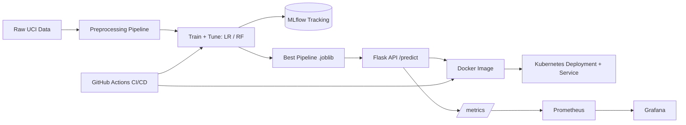

# Heart Disease Prediction — MLOps Assignment Report

> **This is a TEMPLATE, not a finished report.** Replace every `[FILL IN …]`
> with your own findings, numbers, screenshots, and reasoning. Change the
> ordering and wording so it reflects *your* work — identical reports are
> flagged under the academic-integrity policy. Aim for ~10 pages when exported
> to PDF/DOCX (e.g. `pandoc report.md -o report.pdf`).

**Name:** [FILL IN]  **ID:** [FILL IN]  **Course:** AIMLCZG523 — MLOps
**Repository:** [FILL IN GitHub URL]  **Deployed API / access instructions:** [FILL IN]

---

## 1. Project Overview
Briefly state the problem (predict presence/absence of heart disease), the
dataset, and what you built end-to-end. In 4–6 sentences, summarise your
approach and headline result (e.g. best model + ROC-AUC).

`[FILL IN — 1 short paragraph]`

## 2. Setup / Installation
Summarise the steps from the README (env, `pip install`, download, train, serve).
Mention Python version and any OS-specific notes you hit.

`[FILL IN — a few lines or a code block]`

## 3. Dataset & EDA Findings
- Dataset source, size (rows × columns), target balance.
- Missing-value analysis: what you found and how you handled it.
- Key visualisations (embed your own figures from `reports/figures/`):

  
  

- **Insights:** which features correlate most with the target? Anything
  surprising? `[FILL IN — 3–5 bullet observations in your own words]`

## 4. Feature Engineering & Preprocessing
- Numeric vs categorical split you used and *why*.
- Imputation, scaling, encoding choices (ColumnTransformer).
- Train/test split strategy (size, stratification, random seed).

`[FILL IN — describe YOUR choices; consider changing the feature split to
personalise]`

## 5. Model Development & Comparison
Describe the models you trained, the hyper-parameter search, and cross-validation.
Fill this table from your own run (`models/model_metadata.json` + MLflow):

| Model | Accuracy | Precision | Recall | F1 | ROC-AUC | CV ROC-AUC |
|-------|:--------:|:---------:|:------:|:--:|:-------:|:----------:|
| Logistic Regression | [FILL] | [FILL] | [FILL] | [FILL] | [FILL] | [FILL] |
| Random Forest       | [FILL] | [FILL] | [FILL] | [FILL] | [FILL] | [FILL] |
| [your extra model?] | | | | | | |

**Model selection rationale:** which model did you ship and why (metric trade-offs,
recall importance in a medical context, etc.)? `[FILL IN]`

## 6. Experiment Tracking (MLflow)
- What you logged (params, metrics, ROC/confusion-matrix plots, model artifacts).
- **Screenshot:** the MLflow runs comparison view. `[INSERT SCREENSHOT]`

## 7. Model Packaging & Reproducibility
- Serialization format (joblib pipeline) and why the preprocessing is bundled.
- How `requirements.txt` + fixed seeds + metadata ensure reproducibility.

`[FILL IN]`

## 8. Architecture Diagram
Replace this starter diagram with your own (personalise it):

## 9. CI/CD Pipeline
- Describe the stages (lint → test → train → docker build + smoke test).
- Explain how it fails on lint/test errors.
- **Screenshot:** a successful (green) GitHub Actions run. `[INSERT SCREENSHOT]`

## 10. Containerisation
- What's in the image, non-root user, healthcheck.
- **Proof:** `docker build` output + `docker run` + a successful `/predict` call.
  `[INSERT SCREENSHOTS]`

## 11. Deployment
- Platform used (Minikube / Docker Desktop / GKE / EKS / AKS).
- Manifests applied, how the service is exposed (LoadBalancer / Ingress).
- **Screenshots:** `kubectl get pods,svc`, and a request hitting the deployed
  endpoint. `[INSERT SCREENSHOTS]`

## 12. Monitoring & Logging
- Metrics exposed and what they tell you.
- **Screenshots:** Prometheus target UP + a Grafana panel; a few structured log
  lines. `[INSERT SCREENSHOTS]`
- Why monitoring matters for ML (drift, downtime, degradation). `[FILL IN]`

## 13. Challenges & Learnings
Honest reflection: what broke, what you changed, what you'd improve with more
time. This section is heavily weighted for demonstrating *your* understanding.

`[FILL IN — 1–2 paragraphs in your own voice]`

## 14. Links
- GitHub repository: `[FILL IN]`
- Deployed API URL or local access instructions: `[FILL IN]`
- Short pipeline video: `[FILL IN link]`
